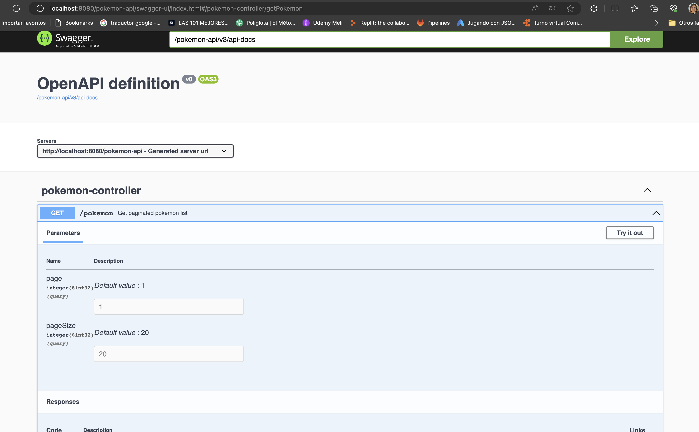

## Pockemon Api

This project consumes an external api to obtain a list of pokemonDtos and returns the paginated
information.

### Features.

- `url local`: http://localhost:8080/pokemon-api
- `Context`: pokemon-api
- `Code building tool`: Gradle
- `Framework`: Spring boot 3.1.2
- `Language`: Java 17

### Available methods.

- `Get price - GET`: http://localhost:8080/pokemon-api/pokemon?page=1&pageSize=20

Response success: Http-Code: 200

```json
{
  "pokemonDtos": [
    {
      "name": "bulbasaur",
      "url": "https://pokeapi.co/api/v2/pokemon/1/"
    },
    {
      "name": "ivysaur",
      "url": "https://pokeapi.co/api/v2/pokemon/2/"
    },
    {
      "name": "venusaur",
      "url": "https://pokeapi.co/api/v2/pokemon/3/"
    },
    {
      "name": "charmander",
      "url": "https://pokeapi.co/api/v2/pokemon/4/"
    },
    {
      "name": "charmeleon",
      "url": "https://pokeapi.co/api/v2/pokemon/5/"
    },
    {
      "name": "charizard",
      "url": "https://pokeapi.co/api/v2/pokemon/6/"
    },
    {
      "name": "squirtle",
      "url": "https://pokeapi.co/api/v2/pokemon/7/"
    },
    {
      "name": "wartortle",
      "url": "https://pokeapi.co/api/v2/pokemon/8/"
    },
    {
      "name": "blastoise",
      "url": "https://pokeapi.co/api/v2/pokemon/9/"
    },
    {
      "name": "caterpie",
      "url": "https://pokeapi.co/api/v2/pokemon/10/"
    },
    {
      "name": "metapod",
      "url": "https://pokeapi.co/api/v2/pokemon/11/"
    },
    {
      "name": "butterfree",
      "url": "https://pokeapi.co/api/v2/pokemon/12/"
    },
    {
      "name": "weedle",
      "url": "https://pokeapi.co/api/v2/pokemon/13/"
    },
    {
      "name": "kakuna",
      "url": "https://pokeapi.co/api/v2/pokemon/14/"
    },
    {
      "name": "beedrill",
      "url": "https://pokeapi.co/api/v2/pokemon/15/"
    },
    {
      "name": "pidgey",
      "url": "https://pokeapi.co/api/v2/pokemon/16/"
    },
    {
      "name": "pidgeotto",
      "url": "https://pokeapi.co/api/v2/pokemon/17/"
    },
    {
      "name": "pidgeot",
      "url": "https://pokeapi.co/api/v2/pokemon/18/"
    },
    {
      "name": "rattata",
      "url": "https://pokeapi.co/api/v2/pokemon/19/"
    },
    {
      "name": "raticate",
      "url": "https://pokeapi.co/api/v2/pokemon/20/"
    }
  ],
  "paging": {
    "page": 1,
    "pageSize": 20,
    "total": 1281,
    "totalPages": 65
  }
}
```

### All endpoints:

Pokemon:

- `GET`: http://localhost:8080/pokemon-api/pokemon?page=1&pageSize=20

## ¿How to run the program?

LOCAL STEPS:

- Clone the project from the following path using the ' git clone: https://github.com/angiekroll/pokemon-api.git '
- Import the project from your IDE in this case intellij
- Compile the project
- Run
- Tester Potsman or from url Swagger: http://localhost:8080/pokemon-api/swagger-ui/index.html

  
- this is curl to test the api
  ```
  curl --location 'http://localhost:8080/pokemon-api/pokemon?page=1&pageSize=20'
  ```


